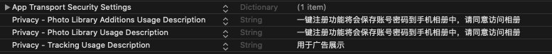

#寰宇SDK接口文档
###环境
* 系统版本:ios9以上
* SDK版本:1.0.0

###1.配置info.plist

```
<key>NSAppTransportSecurity</key>
	<dict>
		<key>NSAllowsArbitraryLoads</key>
		<true/>
	</dict>
	<key>NSPhotoLibraryAddUsageDescription</key>
	<string>一键注册功能将会保存账号密码到手机相册中，请同意访问相册</string>
	<key>NSPhotoLibraryUsageDescription</key>
	<string>一键注册功能将会保存账号密码到手机相册中，请同意访问相册</string>
	<key>NSUserTrackingUsageDescription</key>
	<string>用于广告展示</string>
```


###2.初始化
```
#define GAME_ID @"76"
#define PKG @"yzcs"
#define GameKey @"d0d9558f1cb220177ffa53a46956dcb1"
#define PayKey  @"404df6184ec5810c00b5b893316c5339"
#define SupportURL @"https://www.youku.com"
#define PrivacyURL @"https://www.baidu.com"
[[QFNewSDKPlatform shared]QFinitSDKWithGameID:GAME_ID AndPKG:PKG withGameKey:GameKey payKey:PayKey delegate:self currentViewControler:self];
[[QFNewSDKPlatform shared]QFinitWithSupport:SupportURL Privacy:PrivacyURL];
```

###3.遵守代理
```
@interface ViewController ()<QF_NewSDKPlatformDelegate>

@end

@implementation ViewController
#pragma  mark userInfo返回用户信息
- (void)getUserInfo:(NSDictionary *)userInfo
{
    NSLog(@"userinfo %@",userInfo);
}
#pragma  mark 从SDK退出调用
- (void)logoutFromSDK
{
    NSLog(@"logoutFromSDK");
}
@end
```

###4.显示SDK登录界面
```
- (IBAction)show:(id)sender {
    [[QFNewSDKPlatform shared]QFshow];
}
```

###5.支付
```
- (IBAction)pay:(id)sender {    
    NSDictionary *userInfo = @{@"role_id":@"136331531",
                               @"role_name":@"5f69c3ec26f",
                               @"role_level":@"1",
                               @"role_server_id":@"16651",
                               @"role_server_name":@"Nicds",
      };
      
        
      NSDictionary *goodsInfo = @{@"cp_order_sn":@"TEST10255200609142640000185",
                                @"product_id":@"com.mjzj2.6",
                                @"product_name":@"商品标题",
                                @"product_desc":@"商品标题",
                                @"product_price":@"600",
      };
    

    [[QFNewSDKPlatform shared]QFAppPurchaseWithInfo:userInfo withPurchase:goodsInfo];
    
  
}
```
###6.退出登录
```
- (IBAction)logout:(id)sender {
    [[QFNewSDKPlatform shared] QFlogoutFromGame];
}
```

###7.上报
```
- (IBAction)report:(id)sender {
    
    
    NSDictionary *dic = @{@"role_id":@"729480",
                          @"role_server_id":@"16651",
                          @"role_server_name":@"name",
                          @"role_name":@"5f69c3ec26f",
                          @"role_level":@"0",
    };
      
    
  
    
      [[QFNewSDKPlatform shared]QFRoleAction:dic withType:RoleUpdateReport];
}

```

